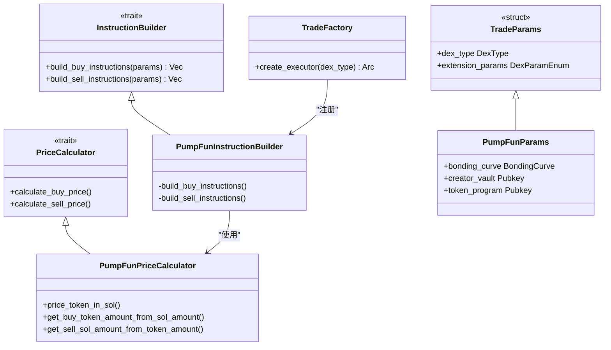
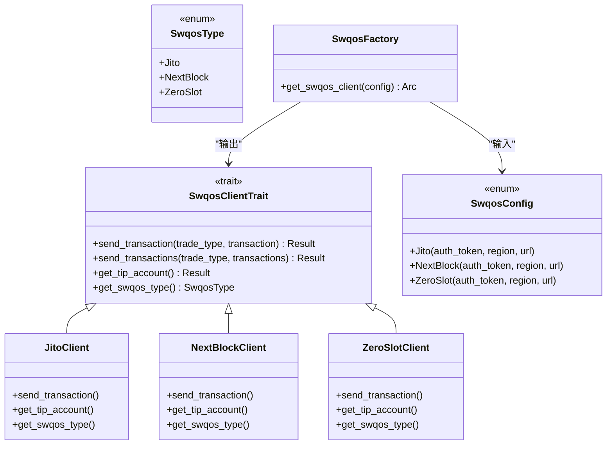

# 高级配置与扩展

<cite>
**本文档中引用的文件**  
- [lib.rs](file://src/lib.rs#L1-L762)
- [factory.rs](file://src/trading/factory.rs#L1-L99)
- [global.rs](file://src/common/global.rs#L1-L127)
- [trade.rs](file://src/constants/trade.rs#L1-L9)
- [swqos.rs](file://src/constants/swqos.rs#L1-L276)
- [pumpfun.rs](file://src/instruction/pumpfun.rs#L1-L291)
- [pumpfun.rs](file://src/utils/calc/pumpfun.rs#L1-L111)
- [pumpfun.rs](file://src/utils/price/pumpfun.rs#L1-L19)
</cite>

## 目录
1. [简介](#简介)
2. [添加新DEX支持](#添加新dex支持)
3. [集成新SWQOS提供商](#集成新swqos提供商)
4. [系统行为参数调整](#系统行为参数调整)
5. [全局配置运行时调优](#全局配置运行时调优)

## 简介
Solana交易SDK提供了一套完整的高级配置和扩展机制，允许开发者根据特定需求定制和扩展其功能。本指南面向希望添加新去中心化交易所（DEX）支持、集成新的Solana Web质量服务（SWQOS）提供商或调整系统行为参数的开发者。SDK通过模块化设计实现了这些扩展点，包括指令构建器模式、价格计算逻辑分离、工厂模式创建执行器以及灵活的配置系统。核心架构围绕`TradeFactory`进行DEX类型注册，通过实现`SwqosProvider` trait集成新的广播提供商，并利用`constants/`目录下的参数和`global.rs`中的全局配置进行系统调优。

**Section sources**
- [lib.rs](file://src/lib.rs#L1-L762)

## 添加新DEX支持
为SDK添加对新DEX的支持需要实现三个核心组件：指令构建器（instruction builder）、价格计算逻辑和交易参数结构，并通过`TradeFactory`注册新类型。首先，需要在`src/instruction/`目录下创建新的模块，实现`InstructionBuilder` trait，该trait定义了`build_buy_instructions`和`build_sell_instructions`异步方法，用于构建特定于DEX的交易指令。其次，在`src/utils/calc/`目录下实现价格计算算法，通常基于该DEX的数学模型（如恒定乘积曲线）。最后，在`src/utils/price/`目录下提供价格查询功能。以PumpFun为例，其指令构建器验证协议参数，计算交易量，准备账户地址，并构建包含方法ID和参数的指令数据。

**Diagram sources**
- [pumpfun.rs](file://src/instruction/pumpfun.rs#L23-L291)
- [pumpfun.rs](file://src/utils/calc/pumpfun.rs#L1-L111)
- [pumpfun.rs](file://src/utils/price/pumpfun.rs#L1-L19)

**Section sources**
- [pumpfun.rs](file://src/instruction/pumpfun.rs#L23-L291)
- [pumpfun.rs](file://src/utils/calc/pumpfun.rs#L1-L111)
- [pumpfun.rs](file://src/utils/price/pumpfun.rs#L1-L19)

## 集成新SWQOS提供商
集成新的SWQOS（Solana Web Quality of Service）提供商需要实现`SwqosProvider` trait并配置广播策略。该trait在`src/swqos/mod.rs`中定义为`SwqosClientTrait`，包含`send_transaction`、`send_transactions`、`get_tip_account`和`get_swqos_type`等方法。开发者需在`src/swqos/`目录下创建新模块，实现该trait以处理与特定提供商的API通信。提供商类型通过`SwqosType`枚举注册，配置通过`SwqosConfig`枚举管理，支持区域选择和自定义URL。广播策略由`SWQOS_BLACKLIST`常量控制，被加入黑名单的提供商将被禁用。例如，Jito、NextBlock等提供商都有各自的客户端实现，通过`get_swqos_client`工厂方法根据配置创建实例。

**Diagram sources**
- [mod.rs](file://src/swqos/mod.rs#L1-L344)

**Section sources**
- [mod.rs](file://src/swqos/mod.rs#L1-L344)

## 系统行为参数调整
系统行为可以通过修改`constants/`目录下的参数进行调整。这些常量定义了交易超时、重试次数、默认滑点、小费金额等关键行为。例如，`src/constants/trade.rs`文件定义了`DEFAULT_SLIPPAGE`（默认滑点10%）、`DEFAULT_TIP_UNIT_LIMIT`（默认小费单位限制150,000）和`DEFAULT_TIP_UNIT_PRICE`（默认小费单价500,000）等。这些参数在交易执行时作为默认值使用，可以在运行时通过交易参数覆盖。此外，`src/constants/swqos.rs`文件定义了各个SWQOS提供商的端点URL、小费账户地址和最低小费要求，如`SWQOS_MIN_TIP_JITO`（Jito最低小费0.00001 SOL）和`SWQOS_MIN_TIP_NEXTBLOCK`（NextBlock最低小费0.001 SOL）。这些常量确保了交易广播的兼容性和可靠性。

**Section sources**
- [trade.rs](file://src/constants/trade.rs#L1-L9)
- [swqos.rs](file://src/constants/swqos.rs#L1-L276)

## 全局配置运行时调优
全局配置运行时调优通过`src/common/global.rs`中的`GlobalAccount`结构体实现。该结构体封装了Pump.fun协议的全局状态，包括初始虚拟储备、费用基点、授权地址等。`GlobalAccount`不仅作为数据容器，还提供了`get_initial_buy_price`等方法，直接实现核心价格计算逻辑。该结构体通过`new()`方法初始化，使用来自`global_constants`模块的预定义常量填充字段。这种设计允许在运行时访问和使用全局配置，而无需每次都从链上获取。开发者可以利用此机制进行性能优化，例如缓存全局账户数据，或根据全局状态调整交易策略。该文件还实现了`serde`的序列化和反序列化，便于与外部系统交换配置数据。

**Section sources**
- [global.rs](file://src/common/global.rs#L1-L127)