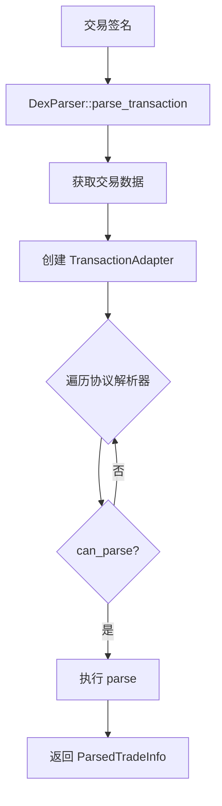
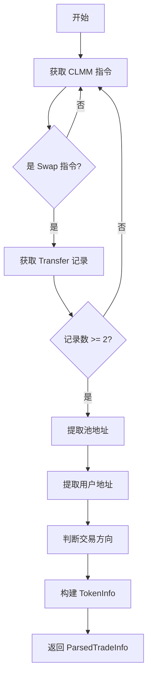

# DEX 交易解析器实现总结

## 概述

Sol Trade SDK 包含完整的 DEX 交易解析器，可以从交易签名解析出详细的交易信息（买入/卖出等 Swap 操作）。

## 支持的协议

- **PumpSwap** (pAMMBay6oceH9fJKBRHGP5D4bD4sWpmSwMn52FMfXEA)
- **Raydium AMM V4** (675kPX9MHTjS2zt1qfr1NYHuzeLXfQM9H24wFSUt1Mp8)
- **Raydium CPMM** (CPMMoo8L3F4NbTegBCKVNunggL7H1ZpdTHKxQB5qKP1C)
- **Raydium CLMM** (CAMMCzo5YL8w4VFF8KVHrK22GGUsp5VTaW7grrKgrWqK)

## 架构设计

### 核心组件

```
src/parser/
├── mod.rs                         # 模块入口
├── types.rs                       # 公共类型定义
├── transaction_adapter.rs         # 交易数据适配器
├── base_parser.rs                 # 解析器 Trait 定义
├── dex_parser.rs                  # 主解析器（协议分发）
├── discriminators.rs              # Discriminator 注册表
├── instruction_data_parser.rs     # 指令数据解析器
├── utils/                         # 工具函数
│   └── binary_reader.rs           # 二进制数据读取
├── constants/                     # 常量定义
│   └── discriminators.rs          # Discriminator 常量
├── pumpswap/                      # PumpSwap 协议
│   ├── mod.rs
│   └── events.rs                  # 事件解析
└── raydium/                       # Raydium 协议族
    ├── mod.rs
    ├── clmm.rs                    # CLMM 解析器
    ├── cpmm.rs                    # CPMM 解析器
    └── v4.rs                      # AMM V4 解析器
```

### 设计模式

1. **适配器模式**: `TransactionAdapter` 统一不同数据源
2. **策略模式**: 每个协议独立实现 `DexParserTrait`
3. **注册表模式**: `DiscriminatorRegistry` 管理指令识别
4. **组合模式**: `DexParser` 组合多个协议解析器

## 核心组件详解

### 1. TransactionAdapter (交易适配器)

**作用**: 将 RPC 返回的交易数据转换为统一的内部格式

**核心功能**:
- 解析不同编码格式（base64、json）
- 提取账户、指令、日志等关键信息
- 提供 `Transfer` 记录查询
- 支持内部指令（inner instructions）查询

**关键方法**:
```rust
// 获取指定程序的指令
let instructions = adapter.get_instructions_by_program(&program_id);

// 获取 Transfer 记录
let transfers = adapter.get_transfers_for_instruction(outer_index);

// 获取内部指令
let inner_ixs = adapter.get_inner_instructions_by_program(&program_id);
```

### 2. DexParserTrait (解析器接口)

**作用**: 定义协议解析器的标准接口

```rust
#[async_trait]
pub trait DexParserTrait: Send + Sync {
    /// 解析交易，返回交易信息列表
    async fn parse(&self, adapter: &TransactionAdapter)
        -> Result<Vec<ParsedTradeInfo>, ParseError>;

    /// 返回协议类型
    fn protocol(&self) -> DexProtocol;

    /// 检查是否可以解析该交易
    fn can_parse(&self, adapter: &TransactionAdapter) -> bool;
}
```

### 3. DiscriminatorRegistry (指令识别系统)

**作用**: 精确识别指令类型，区分 Swap 和流动性操作

**设计特点**:
- 使用 8 字节（或 1 字节）标识符
- 统一的注册表管理
- 支持多协议多指令类型
- 类型安全的枚举系统

详见: [Discriminator 系统](./discriminator_system.md)

### 4. InstructionDataParser (指令数据解析器)

**作用**: 当 Transfer 记录不足时，从指令数据 offset 解析代币数量

**核心功能**:
```rust
// 解析 u64 数值
let amount = parse_u64_from_offset(&data, offset)?;

// 解析 u128 数值
let amount = parse_u128_from_offset(&data, offset)?;

// 格式化代币数量
let formatted = format_token_amount(amount_raw, decimals);
```

## 协议解析器实现

### PumpSwap 解析器

**文件**: `src/parser/pumpswap/mod.rs`

**特点**:
- 基于事件日志解析
- 使用 16 字节事件 discriminator
- 支持买入/卖出/流动性操作识别

**核心逻辑**:
1. 提取 Swap 指令的事件日志
2. 解析事件 discriminator 识别操作类型
3. 从事件数据中提取代币信息
4. 构建 `ParsedTradeInfo`

### Raydium CLMM 解析器

**文件**: `src/parser/raydium/clmm.rs`

**特点**:
- 基于 Transfer 记录解析
- 使用 discriminator 系统排除流动性操作
- 支持 inner instructions 和外层指令解析
- 自动识别交易方向（买入/卖出）

**核心逻辑**:
1. 使用 `is_swap_instruction()` 过滤非 Swap 操作
2. 获取指令相关的 Transfer 记录
3. 从 Transfer 的 authority 提取用户地址
4. 判断交易方向（SOL/USDC 进 = 买入）
5. 构建交易信息

**账户结构**:
- `accounts[0]`: 指令签名者
- `accounts[1]`: 用户 Token A 账户
- `accounts[2]`: **池地址**（用于提取）
- `accounts[3]`: 用户 Token B 账户
- `accounts[4]`: Token A Vault
- `accounts[5]`: Token B Vault
- ...

### Raydium CPMM 解析器

**文件**: `src/parser/raydium/cpmm.rs`

**特点**:
- 基于 Transfer 记录解析
- 使用 8 字节 discriminator
- 与 CLMM 类似的解析逻辑

**账户结构**:
- `accounts[0]`: TOKEN_PROGRAM_ID
- `accounts[1]`: Raydium CPMM 程序
- `accounts[2]`: AMM Pool
- `accounts[3]`: **池地址**（用于提取）
- `accounts[4]`: Token A Mint
- `accounts[5]`: Token B Mint
- ...

### Raydium AMM V4 解析器

**文件**: `src/parser/raydium/v4.rs`

**特点**:
- 基于 Transfer 记录解析
- 使用 1 字节 discriminator
- 最简单的账户结构

**账户结构**:
- `accounts[0]`: TOKEN_PROGRAM_ID
- `accounts[1]`: **池地址**（用于提取）
- `accounts[2]`: 用户 Token A 账户
- `accounts[3]`: User Token B account
- ...

## 解析流程

### 标准流程



### 单协议流程（CLMM 示例）



## 使用方法

### 基本用法

```rust
use sol_trade_sdk::parser::DexParser;

// 创建解析器
let parser = DexParser::default();

// 解析交易
let signature = "5GCZ3TR31aDRP9LZxznKPBux86jWDyCxt1noCAAhX43...";
let result = parser.parse_transaction(signature).await?;

// 访问解析结果
for trade in result.trades {
    println!("DEX: {}", trade.dex);
    println!("交易类型: {:?}", trade.trade_type);
    println!("用户: {}", trade.user);
    println!("输入: {} {}", trade.input_token.amount, trade.input_token.mint);
    println!("输出: {} {}", trade.output_token.amount, trade.output_token.mint);
}
```

### 高级用法

```rust
// 使用特定解析器
use sol_trade_sdk::parser::raydium::clmm::RaydiumClmmParser;

let parser = RaydiumClmmParser::new();
let trades = parser.parse(&adapter).await?;

// 访问详细信息
for trade in trades {
    println!("Pool: {}", trade.pool);
    println!("User: {}", trade.user);

    if let Some(fee) = trade.fee {
        println!("Fee: {} {}", fee.amount, fee.mint);
    }
}
```

## 数据结构

### ParsedTradeInfo

```rust
pub struct ParsedTradeInfo {
    pub user: Pubkey,              // 用户地址
    pub trade_type: TradeType,     // 交易类型
    pub pool: Pubkey,              // 池地址
    pub input_token: TokenInfo,    // 输入代币
    pub output_token: TokenInfo,   // 输出代币
    pub fee: Option<TokenInfo>,    // 手续费
    pub fees: Vec<TokenInfo>,      // 多重费用
    pub dex: String,               // DEX 名称
    pub signature: String,         // 交易签名
    pub slot: u64,                 // Slot
    pub timestamp: i64,            // 时间戳
}
```

### TokenInfo

```rust
pub struct TokenInfo {
    pub mint: Pubkey,              // 代币地址
    pub amount: f64,               // 数量（浮点）
    pub amount_raw: String,        // 原始数量（字符串）
    pub decimals: u8,              // 精度
    pub authority: Option<Pubkey>, // 所有者
    pub source: Option<Pubkey>,    // 来源
    pub destination: Option<Pubkey>, // 目标
}
```

## 错误处理

### ParseError 类型

```rust
pub enum ParseError {
    UnsupportedProtocol(String),
    MissingAccountData,
    ParseFailed(String),
    InsufficientData,
    InvalidData,
}
```

### 错误处理示例

```rust
match parser.parse_transaction(signature).await {
    Ok(result) => {
        println!("解析成功: {} 笔交易", result.trades.len());
    }
    Err(ParseError::ParseFailed(msg)) => {
        eprintln!("解析失败: {}", msg);
    }
    Err(ParseError::UnsupportedProtocol(proto)) => {
        eprintln!("不支持的协议: {}", proto);
    }
    Err(err) => {
        eprintln!("其他错误: {:?}", err);
    }
}
```

## 测试

### 单元测试

每个解析器都有对应的测试模块：

```bash
# 运行所有解析器测试
cargo test --package sol-trade-sdk --lib parser

# 运行特定解析器测试
cargo test --package sol-trade-sdk --lib parser::raydium::clmm
cargo test --package sol-trade-sdk --lib parser::pumpswap
```

### 集成测试

使用真实交易签名进行测试：

```bash
# 运行集成测试
cargo test --test dex_parser_comprehensive
cargo test --test dex_parser_real_tx
```

### 测试素材

测试用例使用的真实交易签名存储在 `docs/txs.md`，包含：
- PumpSwap 交易示例
- Raydium AMM V4 交易示例
- Raydium CPMM 交易示例
- Raydium CLMM 交易示例

## 性能优化

### 1. 并发解析

```rust
// 并发解析多个交易
let tasks: Vec<_> = signatures
    .iter()
    .map(|sig| parser.parse_transaction(sig))
    .collect();

let results = futures::future::join_all(tasks).await;
```

### 2. 缓存机制

```rust
// 缓存解析结果
use std::collections::HashMap;
let mut cache = HashMap::new();

if let Some(cached) = cache.get(&signature) {
    return Ok(cached.clone());
}

let result = parser.parse_transaction(signature).await?;
cache.insert(signature, result.clone());
```

### 3. 批量查询

```rust
// 批量获取交易数据
let transactions = rpc_client.get_multiple_transactions(&signatures).await?;
```

## 扩展性

### 添加新协议

1. **创建解析器文件**: `src/parser/new_protocol/mod.rs`
2. **实现 DexParserTrait**
3. **在 DexParser 中注册**
4. **添加单元测试和集成测试**

```rust
// 示例：添加新协议
pub struct NewProtocolParser;

#[async_trait]
impl DexParserTrait for NewProtocolParser {
    async fn parse(&self, adapter: &TransactionAdapter)
        -> Result<Vec<ParsedTradeInfo>, ParseError> {
        // 实现解析逻辑
    }

    fn protocol(&self) -> DexProtocol {
        DexProtocol::NewProtocol
    }

    fn can_parse(&self, adapter: &TransactionAdapter) -> bool {
        // 检查是否可以解析
    }
}
```

### 添加新 Discriminator

参考 [Discriminator 系统](./discriminator_system.md) 文档。

## 最佳实践

### 1. 优先使用 Transfer 记录

Transfer 记录是最可靠的数据源，应该优先使用。

### 2. Discriminator 过滤

使用 discriminator 系统精确识别 Swap 操作，避免错误解析流动性操作。

### 3. 错误处理

始终处理可能的错误情况，并提供有意义的错误信息。

### 4. 测试覆盖

为每个解析器编写充分的单元测试和集成测试。

### 5. 性能考虑

- 使用 `Arc` 共享数据
- 避免不必要的克隆
- 使用并发查询提高性能

## 故障排查

### 常见问题

1. **解析失败**: 检查交易是否包含目标协议的指令
2. **Transfer 记录不足**: 尝试使用指令数据解析器
3. **用户地址提取失败**: 检查 Transfer 的 authority 字段
4. **池地址提取失败**: 验证账户索引是否正确

### 调试技巧

```rust
// 启用详细日志
env_logger::init();

// 打印指令数据
println!("Instruction data: {:?}", instruction.data);

// 打印 Transfer 记录
for transfer in transfers {
    println!("{:?}", transfer);
}

// 使用 Solscan 查看交易
// https://solscan.io/tx/<SIGNATURE>?cluster=custom&customUrl=http://127.0.0.1:8899
```

## 相关文档

- [Discriminator 系统](./discriminator_system.md)
- [DEX 交易测试素材](./txs.md)
- [交易参数参考](./交易参数参考.md)

## 参考资料

- [solana-dex-parser](https://github.com/kjchoi0530/solana-dex-parser)
- [Solana Transaction Parser](https://github.com/solana-labs/solana-transaction-parser)
- [Anchor Discriminator](https://www.anchor-lang.com/docs/the-discriminator)
